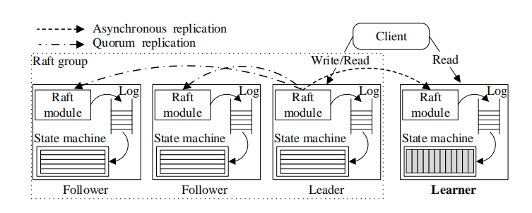

# 基于 Raft 的 HTAP

共识算法（Raft 和 Paxos 等）是构建一致、可扩展和高可用的分布式系统的基石，其优势是使用复制状态机在服务器之间实时可靠地复制数据。通过调整该功能，可以做到针对不同的 HTAP 工作负载将数据复制到不同的服务器。这种方式能够保证 OLTP 和 OLAP 工作负载相互隔离，并且可以使 OLAP 请求得到更新的、一致的数据视图。据研究，以前没有使用共识算法建立 HTAP 数据库的先例。

_**图 1：向 Raft 组添加用于生成列式存储的学习者节点**_

由于 Raft 算法易于理解和实现，所以重点将会放在实现生产就绪的 HTAP 数据库上。如 *图 1* 所示，在较高的层次上，思路是：将数据用行格式存储在多个 Raft 组中，为事务查询提供服务。每个 Raft 组由一个领导者 Leader 和几个追随者 Follower 组成。接着为每个组添加一个学习者角色 Learner ，以异步复制来自领导者的数据。这种方法开销低，并且能够保持数据一致性。复制给 Learner 的数据被转换为列格式。同时，扩展的查询优化器用于探索访问行式和列式副本的物理计划（physical plans）。

在标准的 Raft 实现中，每个 Follower 都可以成为为读写请求提供服务的 Leader 。因此，简单地增加更多的 Follower 无法保证资源隔离。此外，添加更多的 Follower 可能会影响 Raft 组的性能，因为领导者必须等待更大数量节点（总是大多数）的响应，然后才能响应客户端。因此，本研究在 Raft 共识算法中引入学习者角色 Learner 。Learner 不参与领导选举，也不计入日志复制法定人数。从 Leader 到 Learner 的日志复制是异步的；Leader 不需要等待成功后再答复客户端。在从 Leader 读数据时，必须保证 Leader 和 Learner 之间的强一致性。根据设计，Leader 和 Learner 之间的日志复制延迟很低，如实验评估部分所示。

事务查询需要高效的数据更新，而分析查询（如连接 join 或聚合 aggregate）需要按列读取数据的子集，但同时需要读取这些列中大量的行。行格式可以利用索引来有效地进行事务查询。列格式可以有效地利用数据压缩和矢量化处理。因此，当数据复制到 Learner 时，数据从行格式转换为列格式。此外，Learner 可以部署在单独的物理资源中。因此，事务查询和分析查询能够在独立的资源中得到处理。

这一设计还提供了新的优化机会。由于数据在行格式和列格式副本之间都保持一致，因此查询优化器可以生成访问其中一个或两个存储的执行计划。

本研究提出了扩展 Raft 的思路，以满足 HTAP 数据库对数据实时更新和隔离的需求。为了使 HTAP 数据库生产就绪，还需要克服许多工程挑战，主要包括：

1. 如何构建可扩展的 Raft 存储系统以支持高度并发的读/写？如果数据量超过 Raft 算法管理的每个节点上的可用空间，则需要一种分区策略在服务器上分发数据。此外，在基本的 Raft 流程中，请求是按顺序处理的，任何请求都必须先经过法定人数的 Raft 节点批准后才能响应客户端。此过程涉及网络和磁盘操作，因此非常耗时。这种开销使 Leader 成为处理请求的瓶颈，尤其是在大型数据集上。
2. 如何低延迟地将日志同步到 Learner 中以保持数据新鲜度？正在进行的事务可能会生成一些非常大的日志。Learner 需要有能力快速重放和处理这些日志，以便读取最新数据。由于架构不匹配，将日志数据转换为列格式可能会遇到错误。这可能会延迟日志同步。
3. 如何在保证性能的情况下高效地处理事务和分析查询？大型事务查询需要读写分布在多台服务器中的大量数据。分析查询也会消耗大量资源，并且不应当影响在线事务。为了减少执行开销，还需要在行式存储和列式存储中选出最佳计划。

接下来的章节将会详细阐述 TiDB 的设计和实现，以及 TiDB 是如何解决这些挑战的。
