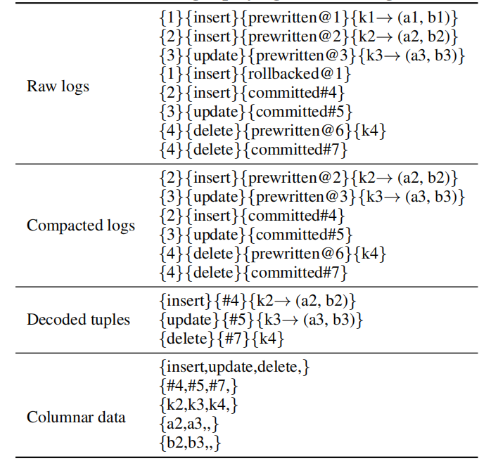

# 列式存储 TiFlash

尽管对从 TiKV 读取数据进行了上述优化，但是 TiKV 中的行格式数据并不适合快速分析。因此，将列式存储（TiFlash）合并到 TiDB 中。TiFlash 由学习者节点 Learner 组成，Learner 仅从 Raft 组接收 Raft 日志，并将行格式的元组转换为列式数据。Learner 不参与 Raft 协议中提交日志或选举领导人的流程，因此在 TiKV 上几乎不会产生开销。

用户可以使用 SQL 语句为表设置列格式副本：`ALTER TABLE x SET TiFLASH REPLICA n;` 其中 x 是表名，n 是副本数量，默认值为 1 。添加列副本类似于向表中添加异步列索引。在 TiFlash 中，每个表按照 TiKV 中的几个连续区块（Regions）被划分为多个分区（partitions），每个分区覆盖一个连续的元组范围。更大的分区便于范围扫描。

当初始化一个 TiFlash 实例时，相关区块的 Raft Leader 开始将数据复制给新的 Learner 。如果有太多数据需要快速同步，Leader 会发送其数据的快照。一旦初始化完成，TiFlash 实例开始侦听 Raft 组中的更新。Learner 收到日志包后，会将日志应用到本地状态机，包括重放日志、转换数据格式以及更新本地存储中的引用值。

在接下来的小节中，将会揭示 TiFlash 高效应用日志、并与 TiKV 保持一致视图的秘诀。这解决了第 2 节中的第二个挑战。

## 日志重放器

根据 Raft 算法，Learner 接收的日志是可线性化的。为了保持提交数据的可线性化语义，将会根据先进先出（FIFO）策略进行重放。日志重放有三个步骤：

1. **压缩日志** 根据后面 5.1 节中对事务模型的描述，事务日志分为三种状态：预写、提交或回滚。回滚日志中的数据不需要写入磁盘，因此压缩过程会根据回滚日志删除无效的预写日志，并将有效日志放入缓冲区。
2. **解码元组** 缓冲区中的日志被解码为行格式的元组，去除关于事务的冗余信息。然后，将解码后的元组放入行缓冲区。
3. **转换数据格式** 如果行缓冲区中的数据大小超过大小限制或其持续时间超过时间间隔限制，这些行格式元组被转换为列数据并写入本地分区数据池。转换指的是本地缓存模式，如后面所述，这些模式定期与 TiKV 同步。

为了说明日志重放过程的细节，考虑下面的例子。将每个 Raft 日志项抽象为 `事务-ID 操作类型[transaction status][@start ts][#commit ts] 操作数据` 。根据典型 DMLs ，操作类型包括插入、更新和删除元组。事务状态可以是预写、提交或回滚。操作数据可以是专门插入或更新的元组，或者是删除的键。

_**表 1：日志重放和解码**_

在 *表 1* 所示的例子中，原始日志包含八个项，试图插入两个元组、更新一个元组和删除一个元组。但是插入 k1 被回滚，所以八个原始日志项中只有六个被保留，从中解码出三个元组。最后，三个解码后的元组被转换成五列：操作类型、提交时间戳、键和两列数据。这些列被附加到 DeltaTree 中。

## 模式同步

为了将元组实时转换成列格式，Learner 必须知道最新的模式。这种模式化过程（schemaful process）与 TiKV 上的无模式操作不同，后者会将元组编码为字节数组。最新的模式信息存储在 TiKV 中。为减少 TiFlash 向 TiKV 请求最新模式的次数，每个 Learner 都会维护一个模式缓存。

缓存通过模式同步器与 TiKV 的模式同步。如果缓存的模式过期，那么正解码的数据就会和本地模式不匹配，必须重新转换数据。模式同步的频率和模式不匹配的数量之间存在某种权衡。这里采取两阶段策略：

- **定期同步** 模式同步器定期从 TiKV 获取最新的模式，并将更改应用到本地缓存。大多数情况下，这种临时同步会降低模式同步的频率。
- **强制同步** 如果模式同步器检测到不匹配的模式，就主动从 TiKV 获取最新模式。像元组和模式之间的列号不同或列值溢出时，就会触发这种情况。

## 列式 Delta Tree

[figure4-the-columnar-delta-tree](../assets/figure4-the-columnar-delta-tree.png)

_**图 4：列式 Delta Tree**_

为了高效地读写高吞吐量的列式数据，设计了一个新的列存储引擎 —— Delta Tree ，能够立即追加增量更新，然后将其与每个分区之前的稳定版本合并。增量更新和稳定数据分别存储在 Delta Tree 中，如 *图 4* 所示。在稳定空间中，分区数据以块的形式存储，并且每个块覆盖较小的分区元组范围。此外，这些行格式的元组是逐列存储的，而增量按照 TiKV 的生成顺序直接追加到增量空间中。TiFlash 中列式数据的存储格式与 Parquet [4] 类似，而行组也会存储到列块中。不同的是，TiFlash 将行组的列数据及其元数据存储到不同的文件中，以同时更新文件，而不是像 Parquet 那样只存储一个文件。TiFlash 只是使用通用的 LZ4 [2] 压缩数据文件来保存磁盘大小。

新传入的增量是插入数据或删除范围的原子批处理。这些增量缓存到内存，并固化到磁盘中。由于是按顺序存储，故而实现了预写日志（write ahead log, WAL）的功能。增量通常存储在许多小文件中，因此在读取时会导致较大的 I/O 开销。为了降低成本，会定期将小增量压缩成较大的增量，然后将其刷新到磁盘上，并替换以前固化的小增量。传入增量的内存副本有助于读取最新数据，如果旧增量达到限制的大小，就会被删除。

当读取某些特定元组的最新数据时，有必要将所有增量文件与其稳定元组合并（即读取放大），因为相事先不知道相关增量的分布位置。由于要读取大量文件，所以成本很高。此外，许多增量文件可能包含无用的数据（即空间放大），既浪费存储空间又减缓与稳定元组的合并速度。因此，定期将增量合并到稳定空间中。每个增量文件及其相关块被读入内存并合并。增量中插入的元组被添加到稳定的元组中，修改的元组替换原始元组，删除的元组被移除。合并的块自动替换磁盘中的原始块。

合并增量的成本很高，因为相关的键在增量空间中是无序的。这种无序还会减缓将增量与稳定块集成以返回读取请求的最新数据的速度。因此，在增量空间的顶部构建 B+ Tree 索引。每个增量更新项都被插入到 B+ Tree 中，并按其关键字和时间戳进行排序。当响应读取请求时，此顺序优先级有助于高效地定位键范围的更新或在增量空间中查找单个键。另外， B+ Tree 中的有序数据更易与稳定块合并。

在 TiFlash 中对 Delta Tree 与 LSM Tree [28] 的性能进行微观对比实验，数据根据 Raft 日志进行更新。共设置三个 TiKV 节点和一个 TiFlash 节点，硬件配置在实验部分列出。TiKV 上运行 Sysketch [6] 的唯一写工作负载，TiFlash 上运行`"select count(id), count(k) from sbtest1"`。为了避免数据压缩的写入放大，使用通用压缩而不是层次压缩来实现 LSM 存储引擎。ClickHouse [1]（面向列的 OLAP 数据库）也采用了这种实现。

_**表 2：Delta Tree 和 LSM Tree 的读取性能**_

如 *表 2* 所示，无论有 1 亿还是 2 亿元组还是事务工作负载，从 Delta Tree 读取数据的速度都比 LSM Tree 快将近两倍。这是因为在 Delta Tree 中，每个读操作最多访问 B+ Tree 中索引的一级增量文件，而访问 LSM Tree 中更多的重叠文件。在不同的写入工作负载下，性能几乎保持稳定，因为增量文件的比例几乎相同。虽然 Delta Tree 的写入放大倍数（16.11）大于 LSM Tree（4.74），但也是可以接受的。

## 读取过程

像 Follower 读取一样，Learner 提供快照隔离，因此可以在特定时间戳从 TiFlash 读取数据。在接收到读取请求后，Learner 向其 Leader 发送读取索引请求，以获取涵盖所请求时间戳的最新数据。作为响应，Leader 将引用的日志发送给 Learner ，Learner 回放并存储日志。一旦日志被写入 Delta Tree ，就会读取 Delta Tree 中的特定数据以响应读取请求。
