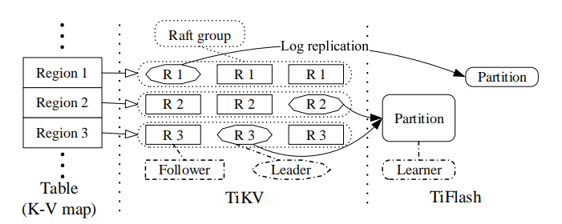

# Multi-Raft 存储

_**图 3：multi-Raft 存储体系结构**_

*图 3* 展示出 TiDB 中分布式存储层的体系结构，其中形状相同的对象扮演的角色也相同。存储层由行式存储 TiKV 和列式存储 TiFlash 组成。存储将一个大型表映射成一个大的键值映射，而该映射会被分割成存储在 TiKV 中的多个区块。每个区块使用 Raft 共识算法来保持副本之间的一致性，以实现高可用性。当数据被复制到 TiFlash 时，可以将多个区块合并到一个分区中，以方便表扫描。TiKV 和 TiFlash 之间的数据通过异步日志复制保持一致。由于存在多个 Raft 组管理分布式存储层中的数据，所以称之为 multi-Raft 存储。下面几节将会详细描述 TiKV 和 TiFlash ，重点介绍如何优化 TiDB ，使之成为生产就绪的 HTAP 数据库。
