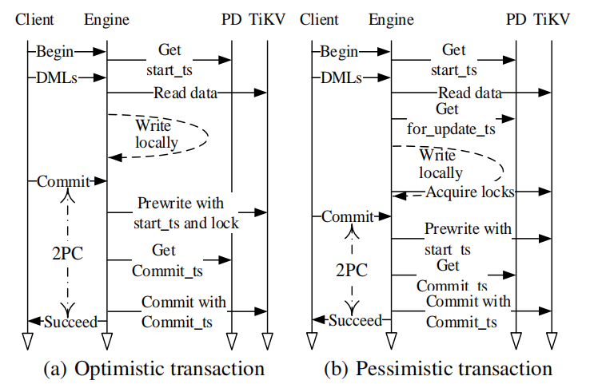

# 事务处理

TiDB 为 ACID 事务提供快照隔离（snapshot isolation, SI）或可重复读取（repeatable read, RR）语义。快照隔离允许事务中的每个请求读取版本一致的数据。可重复读取意味着事务中的不同语句可能为同一个键读取不同的值，但是重复读取（即两次读取的时间戳相同）将始终读取相同的值。这一实现基于多版本并发控制（multi-version concurrency control, MVCC），避免读写锁定并防止读写冲突。

TiDB 中，事务由 SQL 引擎、TiKV 和 PD 三方之间协作完成。事务处理过程中，每个组件的职责如下：

- SQL 引擎：协调事务。接收来自客户端的写读请求，将数据转换为键值格式，并使用两阶段提交（two-phase commit, 2PC）将事务写入 TiKV 。
- PD：管理逻辑区块和物理位置；提供严格递增的全局时间戳。
- TiKV：提供分布式事务接口，实现 MVCC ，并将数据持久化到磁盘。

_**图 5：乐观事务和悲观事务的处理**_

TiDB 实现乐观锁和悲观锁。这一实现改编自 Percolator 模型，该模型选择一个键作为主键，并用之代表事务的状态，并用 2PC 进行事务处理。乐观事务的过程如 *图 5* 左侧所示。（为简单起见，该图忽略了异常处理。）

1. 从客户端接收到 “开始（begin）” 命令后，SQL 引擎向 PD 请求一个时间戳作为事务的开始时间戳（start ts）。
2. SQL 引擎通过从 TiKV 读取数据并写入本地内存来执行 SQL DMLs 。TiKV 提供事务开始时间戳（start ts）之前提交时间戳（commit ts）最近的数据。
3. SQL 引擎收到客户端的 “提交（commit）” 命令时，启动 2PC 协议。随机选择一个主键，并行锁定所有键，并将预写发送到 TiKV 节点。
4. 如果所有预写操作都成功，那么 SQL 引擎会向 PD 请求事务处理的提交时间戳，并向 TiKV 发送提交命令。TiKV 提交主键，并将 “成功（success）” 响应发送回 SQL 引擎。
5. SQL 引擎将 “成功” 返回给客户端。
6. SQL 引擎向 TiKV 发送进一步的提交命令来异步、并行地提交从键并清除锁。

乐观事务和悲观事务的主要区别在于何时获取锁。在乐观事务中，锁是在预写阶段（上面的 *步骤 3*）增量获取的。而在悲观事务中，锁是在预写前执行 DMLs 时获取的（*步骤 2* 的一部分）。这意味着，一旦开始预写，事务不会因为与另一个事务发生冲突而失败。（但仍然可能由于网络分区或其他问题而失败）

悲观事务中锁定键时，SQL 引擎会获取一个新的时间戳，称为更新时间戳（for update ts）。如果 SQL 引擎无法获取锁，就可以从该锁开始重试事务，而无需回滚并重试整个事务。读取数据时，TiKV 使用更新时间戳而不是开始时间戳来决定可以读取键的哪个值。以这种方式，悲观事务即使在事务部分重试时仍然保持可重复读取的隔离级别。

对于悲观事务，用户也可以选择要求仅读取已提交（read committed, RC）隔离级别。这进一步减少事务之间的冲突，从而提高了性能，但代价是减少隔离事务的数量。实现上的区别是：对于可重复读取，如果读取试图访问被另一个事务锁定的键，TiKV 必须报告冲突；对于读取已提交，可以忽略锁进行读取。

TiDB 不需要集中式锁管理器就可以实现分布式事务。锁存储在 TiKV 中，具有相当高的可扩展性和可用性。此外，SQL 引擎和 PD 服务器也是可扩展的，可以处理 OLTP 请求。跨服务器同时运行多个事务可以实现高度的并行性。

向 PD 请求时间戳。每个时间戳包括物理时间和逻辑时间。物理时间是指毫秒精度的当前时间，逻辑时间取 18 位。所以理论上 PD 每毫秒可以分配 2 个时间戳。实际上，每秒可以生成大约 100 万次时间戳，因为分配时间戳只需要几个周期。客户端每批一次性请求时间戳来分摊开销，特别是网络延迟。目前，在实验和许多生产环境中，获取时间戳不是性能瓶颈。
