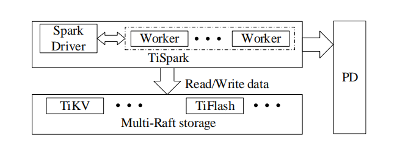

# 分析处理

本节将会描述针对 OLAP 查询的优化，包括优化器、索引以及在定制 SQL 引擎和 TiSpark 中进行下推计算。

## SQL 引擎中的查询优化

TiDB 通过两阶段查询优化来实现查询优化器：基于规则优化（RBO）会生成逻辑计划，然后基于成本优化（CBO）将逻辑计划转换为物理计划。基于规则优化有一套丰富的转换规则，包括裁剪不必要的列、消除投影、下推谓词、派生谓词、常量折叠、消除 "group by" 或外部连接以及取消嵌套子查询。基于成本优化将会根据执行成本从候选计划中选择成本最低的计划。注意，TiDB 提供两类数据存储，TiKV 和 TiFlash ，因此扫描表通常有三个选项：扫描 TiKV 中的行格式表，扫描 TiKV 中有索引的表，以及扫描 TiFlash 中的列。

索引对于提高数据库中的查询性能非常重要，通常用于点获取或范围查询，为散列连接和合并连接提供成本更低的数据扫描路径。TiDB 实现了可扩展的索引，以在分布式环境中工作。由于维护索引会消耗大量的资源，并且可能会影响在线事务和分析，故而选择在后台以非同步的形式构建或删除索引。索引是以与数据相同的方式按区块分割，并作为键值存储在 TiKV 中。唯一键索引上的索引项编码为：

```
Key: {table{tableID} index{indexID} indexedColValue}
Value: {rowID}
```

非唯一索引上的索引项被解码为：

```
Key: {table{tableID} index{indexID} indexedColValue rowID}
Value: {null}
```

使用索引需要二分查找来定位包含索引相关部分的区块。为了提高索引选择的稳定性并减少物理优化的开销，使用 skyline 剪枝算法来消除无用的候选索引。如果有多个候选索引匹配不同的查询条件，将合并部分结果（即一组合格的行标识符）以获得更精确的结果集。

物理计划（基于成本优化的结果）由 SQL 引擎层使用拉取迭代器模型（pulling iterator model）[17] 执行。通过将部分计算下推到存储层，可以进一步优化执行。在存储层，执行计算的组件称为协处理器。协处理器在不同的服务器上并行执行执行计划的子树。这减少了必须从存储层发送到引擎层的元组数量。例如，通过评估协处理器中的过滤器，在存储层中过滤掉被拒绝的元组，只有被接受的元组才需要发送到引擎层。协处理器可以评估逻辑运算、算术运算和其他常见功能。在某些情况下，可以执行聚合和 TopN 。协处理器可以通过向量化操作进一步提高性能：不再对整行进行迭代，而是改为批处理，并按列组织数据，从而提高迭代效率。

## TiSpark

为了帮助 TiDB 连接到 Hadoop 生态系统，TiDB 在 multi-Raft 存储上添加了 TiSpark 。除了 SQL ，TiSpark 还支持强大的计算，比如机器学习库，并且能够处理 TiDB 外部的数据。



_**图 6：TiSpark 和 TiDB 的交互**_

*图 6* 展示了 TiSpark 如何与 TiDB 集成。在 TiSpark 中，Spark 驱动程序从 TiKV 读取元数据来构建 Spark 目录，包括表模式和索引信息。Spark 驱动程序请求 PD 提供时间戳来从 TiKV 读取 MVCC 数据，以确保获得数据库的一致快照。像 SQL 引擎一样，Spark 驱动程序可以将计算下推到存储层的协处理器上，并使用可用索引。这是通过修改 Spark 优化器生成的计划来完成的。此外还定制一些读取操作来从 TiKV 和 TiFlash 中读取数据，并为 Spark 执行器组装成行。例如，TiSpark 可以同时从读取多个 TiDB 区块，并且可以从存储层并行地获取索引数据。为了减少对特定版本 Spark 的依赖，这些功能大多数都在其他程序包中实现。

TiSpark 与普通连接器有两个方面不同。不仅可以同时读取多个数据区块，还可以从存储层并行获取索引数据。读取索引可以帮助 Spark 优化器选择最佳计划来降低执行成本。另一方面，TiSpark 修改由 Spark 中的原始优化器生成的计划，将部分执行下推到存储层的协处理器，这进一步降低了执行开销。除了从存储层读取数据之外，TiSpark 还支持通过事务在存储层中加载大数据。为了实现这一点，TiSpark 采用两阶段提交和锁定表。
