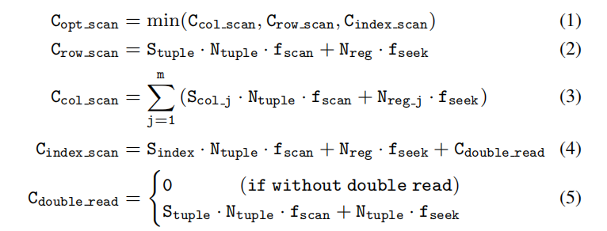

# 隔离和协作

资源隔离是保证事务查询性能的有效方法。分析查询通常会消耗大量资源，如 CPU、内存和 I/O 带宽。如果这些查询与事务查询一起运行，后者可能会严重延迟。这个一般原理在以前的工作 [24，34] 中已经得到验证。为了避免 TiDB 中出现此问题，在不同的引擎服务器上安排分析和事务查询，并在不同的服务器上部署 TiKV 和 TiFlash 。事务查询主要访问 TiKV ，而分析查询主要访问 TiFlash 。通过 Raft 维护 TiKV 和 TiFlash 之间的数据一致性的开销很低，因此使用 TiFlash 运行分析查询对事务处理的性能影响很小。

TiKV 和 TiFlash 之间的数据一致，因此可以通过读取 TiKV 或 TiFlash 为查询服务。因此，查询优化器可以在更大的物理计划空间中作出选择，并且最佳计划可以同时从 TiKV 和 TiFlash 中读取数据。TiKV 访问表时，提供行扫描和索引扫描，TiFlash 支持列扫描。

这三种访问路径的执行成本和数据顺序属性方面各不相同。行扫描和列扫描按主键提供顺序；索引扫描根据键的编码提供几种顺序。不同路径的成本取决于平均元组/列/索引大小（Stuple/col/index）和元组/区块的估计数量（Ntuple/reg）。数据扫描的 I/O 开销表示为 fscan ，文件查找成本表示为 fseek 。查询优化器根据 *等式(1)* 选择最佳访问路径。如 *等式(2)* 所示，行式扫描的成本来自扫描连续的行数据和查找区块文件。列式扫描的成本（*等式(3)*）是扫描 m 列的总和。如果索引列不满足表扫描所需的列，则索引扫描（*等式(4)*）应考虑扫描索引文件的成本和扫描数据文件的成本（即，重复读）。注意，重复读通常会随机扫描元组，这涉及到 *等式(5)* 中的查找更多文件。

_**成本等式**_

例如，当查询优化器在同一查询中同时选择行式和列式存储来访问不同表时，`"select T.*, S.a from T join S on T.b=S.b where T.a between 1 and 100"` 。这是一个典型的连接查询，其中 T 和 S 在行式存储中的 a 列以及列式副本上有索引。最好使用索引从行式存储中访问 T ，从列式存储中访问 S 。这是因为查询需要 T 的一系列完整元组，通过索引按元组访问数据比使用列式存储成本更低。另一方面，使用列式存储获取 S 的两个完整列成本更低。

TiKV 和 TiFlash 的协作仍然可以保证隔离性能。对于分析查询，只有小范围扫描或点获取扫描（point-get scan）可以通过 Follower 读取来访问 TiKV ，对 Leader 几乎没有影响。将 TiKV 上用于分析查询的默认访问表大小限制为最大 500 MB 。事务查询可以访问 TiFlash 中的列数据，以检查一些约束，如唯一性（uniqueness）。为特定表设置多个列式副本，并且其中一个表副本专用于事务查询。在单独的服务器上处理事务查询可以避免影响分析性查询。
