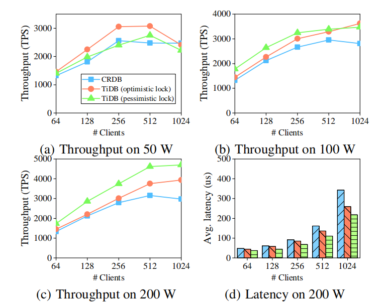
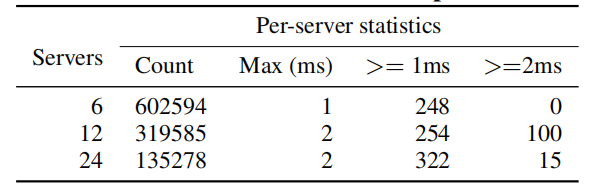

# OLTP 性能

CH-benCHmark 的 OLTP 部分，使用乐观锁或悲观锁来评估 TiDB 的独立 OLTP 性能；即 TPC-C 基准。比较双方是 TiDB 和另一个分布式 NewSQL —— CockroachDB（CRDB）。CRDB 部署在六台同类服务器上。对于 TiDB ，SQL 引擎和 TiKV 部署在六台服务器上，实例分别绑定到每台服务器上的两个 NUMA 节点上。PD 部署在六台服务器中的三台上。为了平衡请求，TiDB 和 CRDB 都通过 HAProxy 负载平衡器进行访问。实验使用不同数量的客户端测量 50、100 和 200 个仓库的吞吐量和平均延迟。

_**图 7：OLTP 性能**_

*图 7(b)* 和 *图 7(c)* 中的吞吐量与 *图 7(a)* 不同。在 *图 7(a)* 中，少于 256 个客户端时，TiDB 的吞吐量随着乐观锁和悲观锁的客户端数量而增加。超过 256 个客户端后，乐观锁的吞吐量开始保持稳定，然后开始下降，而悲观锁的吞吐量在 512 个客户端时达到最大值，然后下降。*图 7(b)* 和 *图 7(c)* 中 TiDB 的吞吐量不断增加。这一结果符合预期，因为并发性高且数据量小的情况下，资源争用十分严重。

一般来说，乐观锁比悲观锁性能更好，除了在较小的数据大小和高并发性（50 或 100 个仓库上有 1024 个客户端）的情况下。该情形下，资源争用非常激烈，会导致许多乐观事务重试。由于 200 个仓库的资源争用更少，乐观锁定仍然会产生更好的性能。

在大多数情况下，TiDB 的吞吐量要高于 CRDB ，尤其是在大型仓库上使用乐观锁时。即使为了公平比较而采用悲观锁（CRDB 总是使用悲观锁），TiDB的性能仍然更高。TiBD 的性能优势是由于事务处理的优化和 Raft 算法。

*图 7(d)* 显示，更多的客户端导致更久的延迟，尤其是在达到最大吞吐量之后，因为更多的请求不得不等待更长的时间。这也是仓库越少延迟越大的原因。对于某些客户端来说，更高的吞吐量会降低 TiDB 和 CRDB 的延迟。50 个和 100 个仓库也有类似的结果。

_**表 3：时间戳性能**_

实验同样评估向 PD 请求时间戳的性能，因为这可能是一个潜在的瓶颈。使用 1200 个客户端连续请求时间戳，这些客户端分布在集群中不同的服务器上。模拟 TiDB，每个客户端分批向 PD 发送时间戳请求。如 *表 3* 所示，六台服务器中的每一台每秒都可以接收 602594 个时间戳，这是运行 TPC-C 基准测试时所需速率的 100 多倍。当运行 TPC-C 基准测试时，TiDB 每秒最多为每台服务器请求 6000 个时间戳。增加服务器数量时，每台服务器上接收到的时间戳数量会减少，但时间戳总数几乎相同。此速率大大超过了任何实际需求。就延迟而言，只有一小部分的请求耗时1毫秒或2毫秒。因此可以得出的结论：目前从 PD 获取时间戳不是 TiDB 的性能瓶颈。
