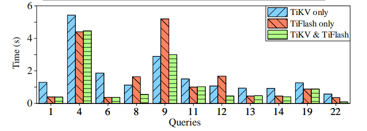
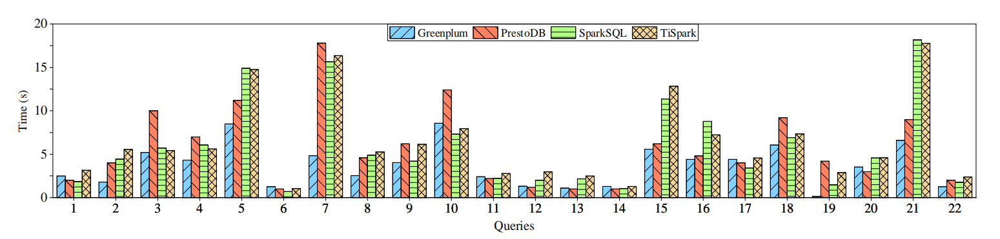

# OLAP 性能

_**图 8：为分析查询选择 TiKV 或 TiFlash**_

从两个角度来评价 TiDB 的 OLAP 性能。首先，就是评估 SQL 引擎的能力，在拥有 100 个仓库的 CH-benCHmark OLAP 部分下选择行式存储或列式存储。一共设置三种存储类型：仅 TiKV 、仅 TiFlash 以及 TiKV 和 TiFlash 的组合。每个查询将会运行五次，并计算平均执行时间。如 *图 8* 所示，如果只从单一类型的存储中获取数据，这两种存储都不更有优势。从 TiKV 和 TiFlash 的组合请求数据的性能总是更好。

Q8 、Q12 和 Q22 的结果比较有趣。在 Q8 和 Q12 中，仅 TiKV 的情况比仅 TiFlash 的情况花费更少的时间，但是在 Q22 中花费更多的时间。TiKV 和 TiFlash 的组合情况比仅 TiKV 和仅 TiFlash 情况性能更好。

Q12 主要包含一个两表连接操作（join），但是每种存储类型中采用不同的物理实现。在仅 TiKV 的情况下，使用索引连接，从表 `ORDER LINE` 中扫描几个合格的元组，并使用索引来查找表 `OORDER` 。索引读取器的成本要低得多，因此它优于仅 TiFlash 时的散列连接，后者扫描两个表中所需的列。当使用 TiKV 和 TiFlash 的组合时，成本会进一步降低，因为使用成本更低的索引连接从 TiFlash 中扫描 `ORDER LINE` ，并使用索引连接从 TiKV 中扫描 `OORDER` 。在 TiKV 和 TiFlash 组合的情况下，采用读取列存储把仅 TiKV 时的执行时间减少了一半。

Q22 的 exists() 子查询被转换为反半连接（anti-semi join）。仅 TiKV 的情况下使用索引连接，仅 TiFlash 的情况下使用散列连接。但与 Q12 的执行不同，使用索引连接比散列连接成本更高。当从 TiFlash 获取内部表并使用 TiKV 中的索引查找外部表时，索引连接的成本得以降低。因此，TiKV 和 TiFlash 的组合再次花费最少的时间。

Q8 包含一个有九个表的连接，所以更复杂一些。仅 TiKV 时，需要 2 个索引连接和 6 个散列连接，并使用索引查找两个表（CUSTOMER 和 OORDER）。该计划需要 1.13 s ，优于仅 TiFlash 时的 8 个散列连接，后者需要 1.64 s 。而 TiKV 和 TiFlash 组合下，开销进一步减少，在这种情况下，除了在 6 个散列连接中扫描 TiFlash 的数据之外，物理计划几乎没有变化。这一改进将执行时间减少到 0.55 s 。这三个查询中，仅 TiKV 或仅 Ti-Flash 可以获得不同的性能，结合起来可以获得最佳结果。

对于 Q1、Q4、Q6、Q11、Q13、Q14 和 Q19 ，仅 TiFlash 的性能优于仅 TiKV 的性能，TiKV 和 TiFlash 组合的性能与仅 TiFlash 的性能相同。对于这七个查询，Q1 和 Q6 主要由单个表中的聚合（aggregate）组成，因此在 TiFlash 列式存储中运行花费的时间更少，这是最优选择。这些结果突出了先前描述的列式存储的优点。Q4 和 Q11 在每种情况下都使用相同的物理计划分别执行。但是从 TiFlash 扫描数据比 TiKV 成本更低，所以仅 TiFlash 时执行时间更短，也是最优选择。Q13、Q14 和 Q19 都包含一个双表连接，用散列连接实现。虽然仅 TiKV 的情况在探测哈希表时采用了索引读取器，但还是比从 TiFlash 扫描数据成本更高。

Q9 是多连接查询。仅 TiKV 时，使用索引对一些表进行索引连接。这比在 TiFlash 上进行散列连接成本更低，因此成为最佳选择。Q7、Q20 和 Q21 产生类似的结果，但是由于空间有限，这里做了省略。22 个 TPC-H 查询中的其余 8 个在三种存储类型中性能相当。

_**图 9：分析查询基准测试对照**_

此外，实验还使用 CH-benCHmark 的 22 个分析查询和 500 个仓库，对比 TiSpark 与 SparkSQL、PrestoDB 和 Greenplum 。每个数据库都安装在六台服务器上。SparkSQL 和 PrestoDB 的数据存储为 Hive 中的列式 Parquet 文件。*图 9* 比较了这些系统的性能。TiSpark 的性能与 SparkSQL 相当，因为使用的引擎相同。性能差距相对比较小，主要来自访问不同的存储系统：扫描压缩的 Parquet 文件成本更低，所以 SparkSQL 通常比 TiSpark 更快。然而，在某些情况下，这种优势会被抵消，因为 TiSpark 可以将更多的计算推送到存储层。将 TiSpark 与 PrestoDB 和 Greenplum 进行比较，就是将 SparkSQL（TiSpark 的底层引擎）与其他两个引擎进行比较。然而，这超出了本文的范围，就不再详细讨论。
