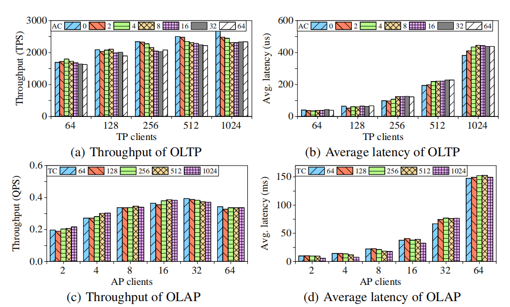

# HTAP 性能

除探究事务处理（transactional processing, TP）和分析处理（analytical processing, AP）性能外，还基于整个 CH-benCHmark 以及独立的事务客户端（transaction clients, TC）和分析客户端（analysis clients, AC）对 TiDB 进行混合工作负载评估。这些实验使用 100 个仓库。数据加载到 TiKV 中，并同时复制到 TiFlash 。TiKV 部署在三台服务器上，由 TiDB SQL 引擎实例访问。TiFlash 部署在另外三台服务器上，并一同配置 TiSpark 实例。按上述配置分别为分析查询和事务查询提供服务。每次运行 10 分钟，预热时间为 3 分钟。基于此对事务处理和分析处理工作负载的的吞吐量和平均延迟进行测量。

_**图 10：TiDB HTAP 性能**_

*图 10(a)* 和 *图 10(b)* 分别显示不同数量的事务客户端和分析客户端的吞吐量和平均延迟。事务吞吐量随着事务客户端的增加而增加，但在略少于 512 个客户端时达到最大值。在事务客户端数量相同的情况下，与没有分析客户端相比，虽然分析处理客户端增加，但事务吞吐量最多降低 10% 。这证实了 TiKV 和 TiFlash 之间的日志复制实现了高隔离，尤其是与第 6.6 节中的 MemSQL 性能形成对比。这个结果与 [24] 中的结果类似。

事务的平均延迟没有上限。这是因为即使更多的客户端发出再多的请求，也无法立即完成，不得不等待。等待时间是延迟增加的原因。

*图 10(c)* 和 *图 10(d)* 中显示的吞吐量和延迟结果相似，展现出事务处理对分析处理请求的影响。分析吞吐量很快就达到 16 个分析客户端下的最大值，因为分析查询很昂贵，并且会产生资源争用。这种争用降低了更多分析客户端的吞吐量。在分析客户端数量相同的情况下，吞吐量几乎保持不变，最多仅下降 5% 。这表明事务处理对分析处理的执行没有显著影响。分析查询的平均延迟增加是因为更多客户端的等待时间越来越长。
