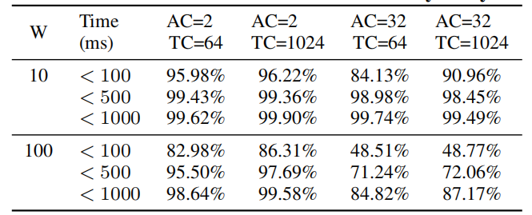
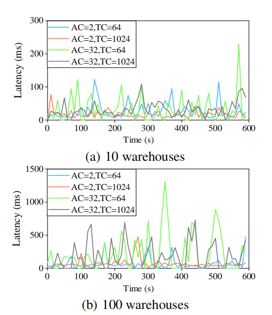

# 日志复制延迟

_**表 4：可观测延迟的计数分布**_

为了实现实时分析处理，事务性更新应该对 TiFlash 即刻可见。数据实时更新能力取决于 TiKV 和 TiFlash 之间的日志复制延迟。运行 CH-benCHmark 时，使用不同数量的事务客户端和分析客户端来测量日志复制时间。记录运行 CH-benCHmark 的 10 分钟内每次复制的延迟，并计算每 10 秒的平均延迟。此外还计算 10 分钟内日志复制延迟的分布，如 *表 4* 所示。

_**图 11：日志复制的可观测延迟**_

如 *图 11(a)* 所示，10 个仓库时的日志复制延迟总是小于 300 ms，大多数延迟小于 100 ms 。*图 11(b)* 显示 100 个仓库时延迟会增加，大多数小于 1000 ms 。*表 4* 中提供更精确的细节。在 10 个仓库时，不管客户端设置如何，几乎 99% 的查询花费不到 500 毫秒。而 100 个仓库时，对于 2 个和 32 个分析客户端，大约 99% 和 85% 的查询花费不到 1000 ms 。这些指标突出表明，TiDB 可以在 HTAP 工作负载时保证大约一秒钟的数据新鲜度。

比较 *图 11(a)* 和 *图 11(b)* 时，可以观察到延迟时间与数据大小有关。仓库越多，延迟越大，因为数据越多，需要同步的日志就越多。此外，延迟还取决于分析请求的数量，但由于事务客户的数量变化而受到影响较小。*图 11(b)* 清楚地展现了这种情况。32 个分析客户端会比 2 个分析客户端引起更多的延迟。但是如果分析客户端数量相同，延迟就不会有太大差异。*表 4* 中显示了更精确的结果。在 100 个仓库和两个分析客户端时，80% 以上的查询占用时间小于100 ms ，但有 32 个分析客户端时，只有不到 50% 的查询占用时间小于 100 ms 。这是因为更多的分析查询会导致更高频率的日志复制。
