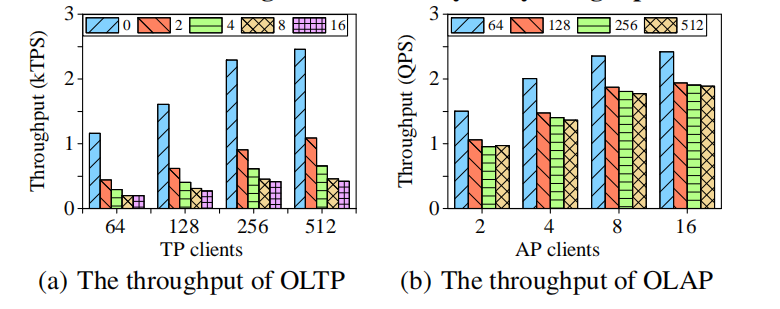

# 与 MemSQL 的比较

实验使用 CH-benCHmark 对比 TiDB 和 MemSQL 7.0 ，旨在突出最先进 HTAP 系统中的隔离问题，而不是 OLTP 和 OLAP 性能。MemSQL 是一个分布式关系数据库，可以处理大规模事务并进行实时分析。MemSQL 同样部署在六台服务器上：一台主服务器、一台聚合器和四台叶服务器。将 100 个仓库加载到 MemSQL 中，并用不同数量的分析客户端和事务客户端运行该基准测试。基准测试进行了 10 分钟，预热时间（warm up period，期待系统进入稳定状态的时间）为 5 分钟。

_**图 12：MemSQL 的 HTAP 性能**_

与 *图 10* 相反，*图 12* 说明了工作负载干扰对 MemSQL 的性能有显著影响。特别是，随着分析客户端数量的增加，事务吞吐量显著下降，降幅超过五倍。随着事务客户端数量的增加，分析吞吐量也会降低，但这种影响并不明显，因为事务查询不会占用大量的分析查询资源。
